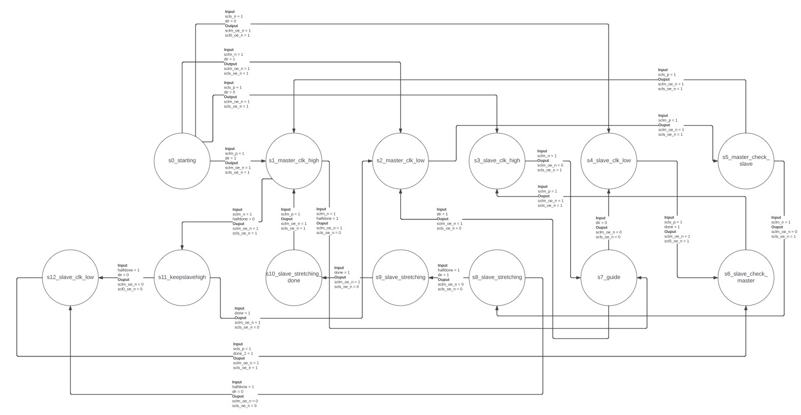
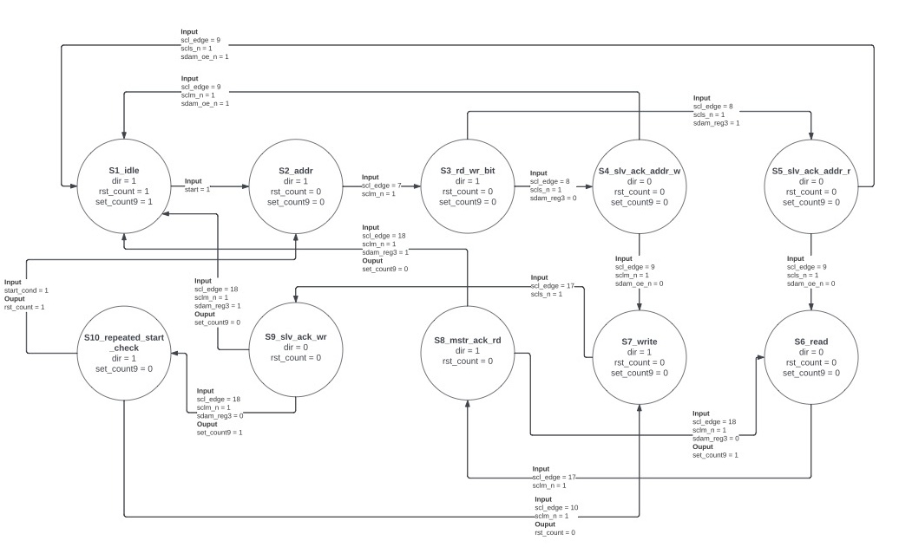

# FPGA_I2C_BUS_Controller

## Mealy Finite-state machine (FSM)
* A 13-state FSM models a sequential logic circuit that controls the output enable of the I/O pins of the FPGA, which are connected to the master and slave clock buses. This FSM is also responsible for detecting whether the slave is busy and holding the clock bus low, which causes clock stretching.
* The state transitions are related to the rising and falling edges of the master and slave clocks, the direction of the write operation (i.e., the device controlling the data (SDA) bus), and the signals that indicate whether the slave is ready and no longer holding the clock bus low.  
State Diagram:
 

## Moore Finite-state machine
* A 10-state FSM models a sequential logic circuit that tracks the ongoing I2C message frame being transmitted. It generates signals for the counter module responsible for tracking the number of clock pulses since the beginning of a message transmission, as well as an input signal for the Mealy FSM to indicate the direction.
* The state transition depends on the number of SCL rising edges that have occurred and the ACK/NACK bit stored in a register.  
State Diagram:
 
